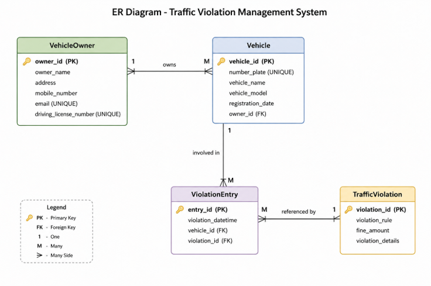
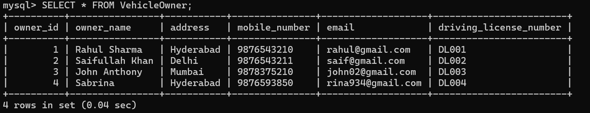
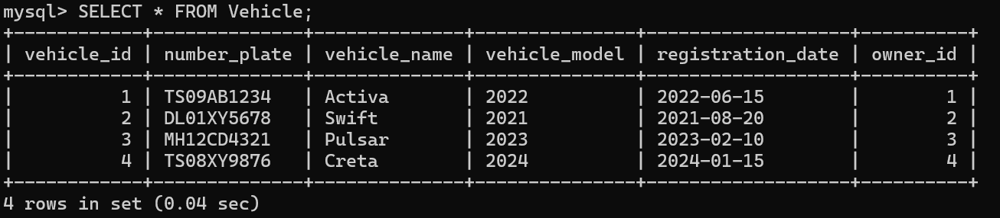
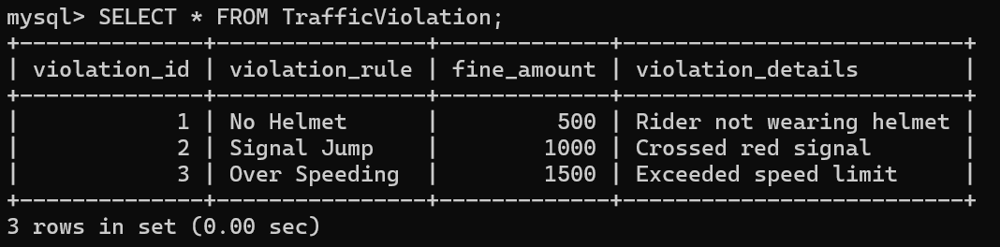
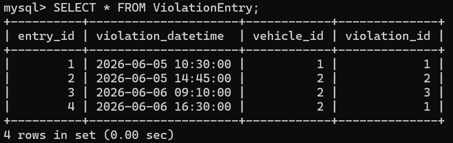
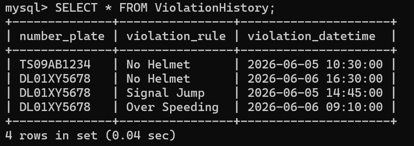

# 🚦 Traffic Violation Management System

A DBMS mini-project developed using **MySQL** to manage vehicle records, traffic violations, and violation history efficiently.

---

## 📌 Project Overview

The Traffic Violation Management System digitizes traffic record management by storing:

- Vehicle owner details
- Vehicle information
- Traffic violation rules
- Violation records

The system uses relational database concepts such as:

- Primary Keys
- Foreign Keys
- Constraints
- Views
- SQL Queries

It also helps identify **repeat offenders** and maintain **violation history**.

---

## 🎯 Objectives

- Maintain records of vehicle owners and vehicles
- Store traffic violation rules and fines
- Record traffic violations
- Track repeat offenders
- Retrieve violation history efficiently

---

## 🛠 Technologies Used

- MySQL 8.0
- MySQL Command Line Client
- Visual Studio Code
- Git
- GitHub

---

## 🗄 Database Tables

1. **VehicleOwner**
2. **Vehicle**
3. **TrafficViolation**
4. **ViolationEntry**

---

## 🔗 Relationships

- One VehicleOwner can own multiple Vehicles (**1:M**)
- One Vehicle can have multiple Violation Entries (**1:M**)
- One TrafficViolation can appear in multiple Violation Entries (**1:M**)

---

## 📊 Entity Relationship Diagram

<p align="center">
  
</p>

---

## 📋 VehicleOwner Table

<p align="center">
  
</p>

---

## 🚗 Vehicle Table

<p align="center">
  
</p>

---

## ⚠️ TrafficViolation Table

<p align="center">
  
</p>

---

## 📝 ViolationEntry Table

<p align="center">
  
</p>

---

## 📈 Violation History View

<p align="center">
  
</p>

---

## 💡 SQL Concepts Used

- DDL (Data Definition Language)
  - CREATE DATABASE
  - CREATE TABLE

- DML (Data Manipulation Language)
  - INSERT

- Constraints
  - PRIMARY KEY
  - FOREIGN KEY
  - UNIQUE
  - NOT NULL
  - CHECK
  - AUTO_INCREMENT

- Views
  - ViolationHistory

- Queries
  - SELECT
  - GROUP BY
  - Aggregate Functions

---

## 🌍 SDG Mapping

This project supports the following United Nations Sustainable Development Goals (SDGs):

### SDG 3: Good Health and Well-Being
Promotes road safety by encouraging adherence to traffic regulations.

### SDG 9: Industry, Innovation and Infrastructure
Demonstrates the use of database technologies for efficient digital systems.

### SDG 11: Sustainable Cities and Communities
Contributes towards safer and smarter transportation systems.

### SDG 16: Peace, Justice and Strong Institutions
Supports transparent and reliable traffic law enforcement.

---

## 🔮 Future Scope

- Online fine payment system
- SMS and email notifications
- Police dashboard
- Mobile application integration
- Automatic CCTV-based violation detection
- E-challan generation
- Analytics and reporting dashboard

---

## 👥 Team Members

- Kausar Jehan (160624733156)
- Umama Nooreen (160624733188)

---

## 🔗 GitHub Repository

```bash
git clone https://github.com/kausar-296/traffic-violation-management-system.git
